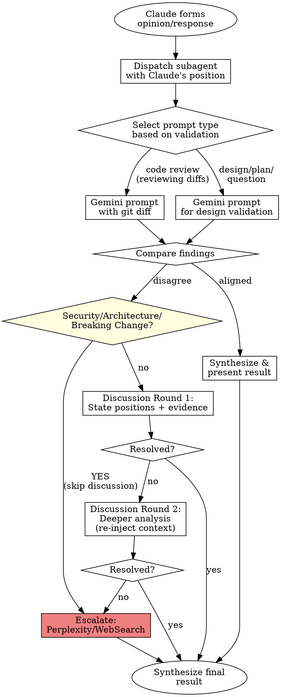

# Gemini Peer Review

Peer validation system using Google Gemini CLI. Validates Claude's designs and code reviews through structured discussion before presenting to user.

**Core principle:** Two AI perspectives catch more issues than one. When they disagree, structured discussion resolves most issues. External research (Perplexity if available, otherwise WebSearch) arbitrates persistent disagreements.

## CRITICAL: Gemini CLI Differences from Codex

| Aspect | Codex CLI | Gemini CLI |
|--------|-----------|------------|
| JSON output | `--json` | `-o json` |
| Model selection | `--model X` | `-m X` |
| Review command | `codex review --base X` | **NONE** - use prompts with git diff |
| Session resume | `resume $SESSION_ID` | **UNRELIABLE** - re-inject context instead |
| Tool prevention | Not needed | **MANDATORY** prompt suffix |
| Sandbox mode | Not needed | `-s` flag required |

### MANDATORY: Tool Prevention

**EVERY Gemini prompt MUST end with:**
```
CRITICAL: Do not use any tools. Output text only.
```

Without this, Gemini may attempt to use tools and produce unexpected results.

### Session Continuity Strategy

Gemini's `--resume latest` is index-based (not ID-based) and unreliable. For multi-round discussions:
- **DO NOT** use `--resume`
- **DO** re-inject the full context from previous rounds into each new prompt

### Robust JSON Parsing (IMPORTANT)

Gemini's `-o json` output is sometimes wrapped in Markdown code blocks. **Always parse output** to extract clean JSON:

```bash
# Function to extract JSON from potentially wrapped output
parse_gemini_output() {
  local input="$1"
  # Strip markdown code fences if present
  echo "$input" | sed 's/^```json//; s/^```//; s/```$//' | \
    # Remove CLI status messages
    grep -v '^Loaded cached' | \
    # Extract response field, or return raw if not JSON
    jq -r '.response // .' 2>/dev/null || echo "$input"
}

# Usage:
RAW_OUTPUT=$(gemini -s -m gemini-3-pro-preview -o json "$(cat "$PROMPT_FILE")" 2>&1)
RESPONSE=$(parse_gemini_output "$RAW_OUTPUT")
```

**Why this matters:** Without parsing, you may get output like:
```
```json
{"response": "actual content here"}
```
```
Instead of clean JSON.

## Reference Files

@discussion-protocol.md
@escalation-criteria.md
@common-mistakes.md

## Modes of Operation

### Mode 1: Auto-Trigger (Validation Only)

**Triggers before Claude presents:**
- Implementation plans or designs
- Code review results
- Architecture recommendations
- Major refactoring proposals

**Behavior:** Validates existing work, does not create from scratch.

### Mode 2: Slash Command (Full Lifecycle)

```
/gemini-peer-review              # Review current changes
/gemini-peer-review --base main  # Review against specific branch
/gemini-peer-review [question]   # Validate answer to broad question
```

**Behavior:** Can both create and validate reviews/designs.

## Workflow



**Immediate Escalation:** Security concerns, architecture conflicts, breaking changes, or order-of-magnitude performance disagreements skip discussion and escalate directly. See @escalation-criteria.md for details.

## Subagent Dispatch

**CRITICAL:** Always use subagent to avoid context pollution. Never run Gemini in main context.

### Command Pattern (ALWAYS USE THIS)

```bash
PROMPT_FILE=$(mktemp /tmp/gemini-prompt-XXXXXX.md)
cat > "$PROMPT_FILE" <<'PROMPT_EOF'
[Your prompt content here]

CRITICAL: Do not use any tools. Output text only.
PROMPT_EOF

gemini -s -m gemini-3-pro-preview -o json "$(cat "$PROMPT_FILE")"
```

### For Code Review (reviewing actual code changes)

**IMPORTANT:** Since Gemini has no `review` command, you must:
1. Get the diff using git
2. Include it in your prompt to Gemini

```bash
# Get the diff
DIFF=$(git diff [branch]...HEAD 2>/dev/null)

# If no diff, check for uncommitted changes
if [ -z "$DIFF" ]; then
  DIFF=$(git diff 2>/dev/null)
  STAGED_DIFF=$(git diff --staged 2>/dev/null)
fi

PROMPT_FILE=$(mktemp /tmp/gemini-prompt-XXXXXX.md)
cat > "$PROMPT_FILE" <<PROMPT_EOF
Review the following code changes for:
- Code quality issues
- Potential bugs
- Security concerns
- Edge cases

Focus area: [Claude's review focus if any]

\`\`\`diff
$DIFF
\`\`\`

Provide specific, actionable feedback.

CRITICAL: Do not use any tools. Output text only.
PROMPT_EOF

gemini -s -m gemini-3-pro-preview -o json "$(cat "$PROMPT_FILE")"
```

### For Design/Plan Validation

```bash
PROMPT_FILE=$(mktemp /tmp/gemini-prompt-XXXXXX.md)
cat > "$PROMPT_FILE" <<'PROMPT_EOF'
Validate this design/refactoring plan:

[Summarize Claude's specific proposal in 2-3 sentences]

Files affected: [list specific files]

Check for:
- Architecture issues
- Potential problems with this approach
- Better alternatives
- Missing considerations

Provide specific, actionable feedback.

CRITICAL: Do not use any tools. Output text only.
PROMPT_EOF

gemini -s -m gemini-3-pro-preview -o json "$(cat "$PROMPT_FILE")"
```

### Validation Subagent Prompt

Dispatch via Task tool with prompt:

```
You are validating Claude's analysis using Google Gemini CLI.

## Claude's Position
[Claude's findings/design/recommendations]

## Scope
- Type: [code-review|design|architecture|question]
- Files: [relevant files - be specific!]

## Task - CHOOSE THE RIGHT APPROACH

### If Type is "code-review" (reviewing actual code changes):
1. Get the diff: git diff [branch]...HEAD (or git diff for uncommitted)
2. Create a Gemini prompt including the diff
3. Run: gemini -s -m gemini-3-pro-preview -o json "$(cat "$PROMPT_FILE")"

### If Type is "design", "architecture", or "question":
Create a focused validation prompt and run with gemini.

**CRITICAL REMINDERS:**
- ALWAYS end prompts with: "CRITICAL: Do not use any tools. Output text only."
- ALWAYS use -s -m gemini-3-pro-preview -o json flags
- ALWAYS use temp files for prompts (avoid shell escaping issues)

## Compare and Classify
After running Gemini:
1. Compare Gemini output to Claude's position
2. Classify: agreement | disagreement | complement

## If Uncertain Before Running Gemini
Check external sources first. Try Perplexity if available, otherwise use WebSearch.

## Return Format
{
  "outcome": "agreement|disagreement|complement",
  "gemini_findings": [...],
  "alignment": {
    "agreed": [...],
    "unique_to_claude": [...],
    "unique_to_gemini": [...]
  },
  "discussion_needed": boolean,
  "discussion_topics": [...]
}
```

### Discussion Subagent

**IMPORTANT:** Do NOT use `--resume` flag. Re-inject context for each round.

#### Round 1 (Initial Discussion)

```bash
PROMPT_FILE=$(mktemp /tmp/gemini-round1-XXXXXX.md)
cat > "$PROMPT_FILE" <<'PROMPT_EOF'
Given this disagreement about [topic]:

Claude's position: [summary with evidence]

Provide your evidence-based reasoning. Reference specific code or conventions.
What is your position and why?

CRITICAL: Do not use any tools. Output text only.
PROMPT_EOF

gemini -s -m gemini-3-pro-preview -o json "$(cat "$PROMPT_FILE")" 2>&1 | tee /tmp/gemini_round1_$$.json
```

#### Round 2 (Context Re-injection - NOT session resume)

```bash
# Re-inject all context - do NOT use --resume
PROMPT_FILE=$(mktemp /tmp/gemini-round2-XXXXXX.md)
cat > "$PROMPT_FILE" <<'PROMPT_EOF'
Continuing discussion about [topic]:

Round 1 summary:
- Claude's position: [summary]
- Gemini's position: [summary from Round 1 output]

Claude's Round 2 response: [new evidence from Claude]

Can we reach synthesis? What is your final position?

CRITICAL: Do not use any tools. Output text only.
PROMPT_EOF

gemini -s -m gemini-3-pro-preview -o json "$(cat "$PROMPT_FILE")"
```

### Arbitration Subagent

When escalating for external research/arbitration:

```
Escalate for external arbitration.

## Disagreement Context
- Topic: [specific technical question]
- Claude's position: [with evidence]
- Gemini's position: [with evidence]
- Why unresolved: [summary of discussion]

## Task - Choose Available Method

### Option 1: If Perplexity MCP is available
1. Check schema: mcp-cli info perplexity/perplexity_ask
2. Call Perplexity with neutral framing

### Option 2: If Perplexity is NOT available
1. Use WebSearch tool with a focused query
2. Search for authoritative sources (official docs, well-known engineering blogs)
3. Synthesize findings from multiple sources

## Apply ruling to synthesis

## Return Format
{
  "arbitration_source": "perplexity|websearch",
  "ruling": "...",
  "sources": ["..."],
  "recommended_action": "...",
  "final_synthesis": "...",
  "confidence": "high|medium"
}
```

## Output Formats

### Agreement
```markdown
## Peer Review Result
**Status:** Validated
**Confidence:** High (both AIs aligned)

[Synthesized recommendations with both perspectives merged]
```

### Resolved Disagreement
```markdown
## Peer Review Result
**Status:** Resolved through discussion

**Initial Positions:**
- Claude: [position]
- Gemini: [position]

**Resolution:** [how resolved, which evidence won]

**Final Recommendation:** [synthesized view]
**Confidence:** Medium-High
```

### External Research Arbitration
```markdown
## Peer Review Result
**Status:** Escalated for external research
**Source:** [Perplexity | WebSearch]

**Disagreement:** [nature of conflict]

**Research Findings:** [authoritative answer]
**Sources:** [URLs if from WebSearch]

**Final Recommendation:** [based on findings + context]
**Confidence:** High (expert arbitration) | Medium (if WebSearch was inconclusive)
```

## Prerequisites

**Before using this skill, verify the following:**

```bash
# 1. Check if Gemini CLI is installed
if ! command -v gemini &>/dev/null; then
  echo "ERROR: Gemini CLI not installed."
  exit 1
fi

# 2. Check version (should be 0.24.5 or later)
gemini --version

# 3. Optional: Check for jq (improves JSON parsing)
command -v jq &>/dev/null || echo "TIP: Install jq for better JSON parsing: brew install jq"
```

**If Gemini CLI is not available:**
- The skill will not work for peer review or design validation
- You can still use WebSearch for escalation/arbitration
- Inform the user: "Gemini CLI is required for peer review."

## Quick Reference

| Scenario | Gemini Approach | Notes |
|----------|-----------------|-------|
| About to present design/plan | Prompt with design details | Include NO_TOOLS suffix |
| About to present code review | Prompt with git diff | Get diff first, then prompt |
| About to present refactoring | Prompt with proposal | Be specific about files |
| About to present architecture | Prompt with recommendation | Include context |
| User asks broad question | Prompt with question | Validate answer |
| Gemini agrees | Synthesize and present | Both AIs aligned |
| Gemini disagrees | Start discussion protocol | Max 2 rounds |
| Two rounds fail | Perplexity/WebSearch | Escalate for research |
| Major issue (security) | Perplexity/WebSearch | Immediate escalation |

**Key reminders:**
- Use `gemini -s -m gemini-3-pro-preview -o json` always
- End EVERY prompt with: `CRITICAL: Do not use any tools. Output text only.`
- Use temp files for prompts (avoid shell escaping)
- Re-inject context for discussion rounds (don't use --resume)
